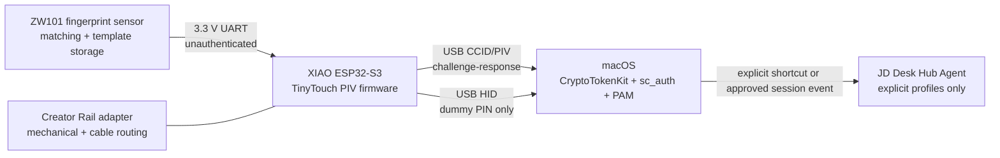

# Project JD Desk Hub v1

Implementation plan and build guide for a fingerprint-gated macOS desk authenticator based on TinyTouch.

**Baseline:** upstream commit `d8ca7701d227daa1201c52b771ed8862749ee589` (2026-07-11)  
**Recommended v1 mode:** PIV/CCID smart card firmware  
**Fallback mode:** encrypted helper plus USB HID password typing  
**Project status:** engineering package; hardware validation still required

> Safety decision: build and validate with normal development flashing first. Secure Boot v2 and flash encryption are a separate, irreversible production-hardening gate because they burn eFuses and change recovery paths.

## 1. Outcome and scope

JD Desk Hub v1 is a wired USB-C, desk-mounted fingerprint puck that:

1. authenticates macOS login, screen unlock, and `sudo` using a fingerprint-gated PIV private-key operation;
2. keeps convenience automations outside the authentication firmware;
3. provides a serviceable, printable enclosure with a removable Creator Rail adapter;
4. leaves a defined upgrade path for a secure element, authenticated biometric transport, touch gestures, status lighting, and profile automation.

V1 is not Touch ID. TinyTouch's ZW101-class sensor performs matching internally and reports the result over unauthenticated UART. An attacker with physical access can spoof that link. The current PIV keys are compiled into ESP flash. Until hardware protections are enabled, a flash dump can recover them. Use this only on a personally controlled Mac in a low physical-threat environment; do not deploy it on employer-managed or regulated systems without security approval.

## 2. What the upstream repository actually provides

### PIV/CCID path - recommended

- ESP-IDF project pinned by `dependencies.lock` to ESP-IDF 5.3.2, `esp_tinyusb` 2.2.1, and TinyUSB 0.19.0~3.
- Composite USB device: CCID/PIV smart card plus HID keyboard.
- PIV slots 9A (RSA-2048 authentication/signing) and 9D (RSA-2048 key management/decrypt).
- Fingerprint-gated private-key use with a 10-second user-presence window.
- A 60-second dummy-PIN verification window and HID submission of `000000` plus Return.
- Sensor matching against template slots 1 through 5.
- macOS pairing through `sc_auth`.

### HID path - fallback only

- Arduino sketch acting as USB CDC plus keyboard.
- A macOS helper stores the real password and a 32-byte pairing key in Keychain.
- Each fingerprint match generates a random nonce and HMAC-authenticated event.
- The helper replies with an HMAC-protected, AES-CTR encrypted one-time password response.
- The ESP decrypts in RAM, types the password, and wipes working buffers.

### Gaps and inconsistencies that v1 must handle

1. **Fingerprint enrollment is absent.** Both production firmwares assume slots 1-5 already contain templates. This package adds a separate enrollment sketch; do enrollment before flashing PIV firmware.
2. **Pin naming is easy to misread.** Upstream prose says pins 6, 7, and 1. These are XIAO labels D6, D7, and D1. The code correctly uses GPIO43, GPIO44, and GPIO2.
3. **Security features are not enabled.** The checked-in `sdkconfig` has Secure Boot and flash encryption disabled.
4. **Upstream chunked-flash instructions contain author-specific paths and a 2 MB flash-size override while the checked-in build config declares 8 MB.** Use standard `idf.py flash` first; do not copy those chunk commands blindly.
5. **The macOS launch agent contains the upstream author's absolute paths and USB serial.** Regenerate it locally instead of copying it as-is.
6. **No test suite or CI is present.** Treat enumeration, APDU behavior, pairing, negative fingerprint cases, and reboot recovery as manual acceptance gates.
7. **PIV implementation is purpose-built, not a general certified PIV token.** It implements the APDU surface needed by the author's macOS flow; interoperability outside that target is unproven.

## 3. System architecture



Security boundary: the automation agent never receives the PIV private key, Mac password, fingerprint image, or sensor template. It is invoked separately by an explicit profile command in v1. A future firmware event channel must be authenticated and must not grant authorization solely because a touch occurred.

## 4. Hardware bill of materials

The machine-readable bill is in `BOM.csv`. Prices are planning estimates in USD as of 2026-08-03; tax, shipping, and marketplace variance are excluded.

### Required electronics

| Qty | Item | Exact selection / requirement | Planning cost |
|---:|---|---|---:|
| 1 | MCU | Seeed Studio XIAO ESP32-S3, non-Sense, SKU 113991114; native USB and 3.3 V UART | $7-10 |
| 1 | Fingerprint sensor | ZW101 circular capacitive UART module, 21.0 mm outer diameter, MX1.0-6P, 3.3 V, touch output, `0xEF01` packet protocol | $10-20 |
| 1 | Sensor harness | 6-conductor MX1.0 cable matched to the purchased module; verify pin order with its datasheet | $1-3 |
| 1 | USB cable | USB-C data cable, 0.5-1 m, known to carry data | $5-10 |
| 1 set | Wire/insulation | 28-30 AWG stranded wire, heat-shrink, solder | $3-6 consumed |

### Enclosure and mounting

| Qty | Item | Specification | Planning cost |
|---:|---|---|---:|
| 1 | Printed top | Matte black PETG/ASA, 0.4 mm nozzle, 0.20 mm layers | $1-3 consumed |
| 1 | Printed base | Same material; print flat on its outside face | $1-3 consumed |
| 4 | Inserts | M2.5 x 0.45 heat-set inserts, short style; select exact bore from supplier drawing | $1-2 consumed |
| 4 | Screws | M2.5 x 6 mm black button-head or socket-head machine screws | $1-2 consumed |
| 4 | Magnets | 10 x 3 mm N35 or stronger discs, optional removable rail/base interface | $2-4 consumed |
| 4 | Feet | 6-8 mm low-profile silicone bumpers for standalone use | $1-2 consumed |
| 1 | Adhesive | Thin 3M 9448A/300LSE-class tape or small neutral-cure silicone dots for sensor retention | $1 consumed |

Expected one-off build total is about **$32-58 before tools and shipping**. Buy two sensors if schedule matters; marketplace pinouts and cable orientation vary.

### Tools

- Temperature-controlled soldering iron with fine tip and a separate insert-setting tip.
- Digital multimeter.
- Flush cutters, wire stripper, tweezers, calipers.
- 3D printer or print service.
- Optional USB current meter and logic analyzer for troubleshooting.

## 5. Wiring

### Authoritative signal map

| ZW101 pin | ZW101 signal | XIAO label | ESP32-S3 GPIO | Notes |
|---:|---|---|---:|---|
| 1 | V_SENSOR | 3V3 | - | Must remain powered for touch detection |
| 2 | TOUCH_OUT | D1 | GPIO2 | Active high; firmware enables internal pulldown |
| 3 | VCC | 3V3 | - | Sensor core power; 2.6-3.6 V, 40 mA typical while operating |
| 4 | TX | D7 / RX | GPIO44 | Sensor TX goes to MCU RX |
| 5 | RX | D6 / TX | GPIO43 | Sensor RX goes to MCU TX |
| 6 | GND | GND | - | Common ground |

Do not power the sensor from 5 V. Do not join TX-to-TX or RX-to-RX. Verify pin 1 orientation on the actual module because harness colors are not standardized.

```text
ZW101 (MX1.0-6P)                      Seeed XIAO ESP32-S3
┌──────────────────┐                 ┌──────────────────────┐
│ 1 V_SENSOR  ─────┼────────────────>│ 3V3                  │
│ 2 TOUCH_OUT ─────┼────────────────>│ D1 / GPIO2           │
│ 3 VCC       ─────┼────────────────>│ 3V3                  │
│ 4 TX        ─────┼────────────────>│ D7 / GPIO44 (RX)     │
│ 5 RX        <────┼─────────────────│ D6 / GPIO43 (TX)     │
│ 6 GND       ─────┼────────────────>│ GND                  │
└──────────────────┘                 │ USB-C -> Mac         │
                                     └──────────────────────┘
```

### Wiring acceptance checks before USB connection

1. With power disconnected, confirm no short between 3V3 and GND.
2. Confirm pins 1 and 3 both reach 3V3.
3. Confirm sensor pin 4 reaches XIAO D7, not D6.
4. Confirm sensor pin 5 reaches XIAO D6, not D7.
5. Confirm touch output reaches D1.
6. Confirm no conductor can touch the sensor's metal ring or adjacent pads.

## 6. Build sequence

### Phase A - bench prototype

1. Clone the fork and record the upstream commit.
2. Inspect the sensor label and connector orientation; compare against the ZW101 datasheet.
3. Wire the sensor on the bench using short leads, ideally under 100 mm.
4. Flash the enrollment sketch in `firmware/tiny_touch_enroller`.
5. Enroll the same primary finger in slots 1 and 2 at different natural angles; enroll a backup finger in slot 3.
6. Power-cycle and confirm a match and a rejection using the enroller's serial output.
7. Generate PIV keys locally, build the PIV firmware, and flash it.
8. Confirm USB smart-card enumeration before pairing.
9. Pair only after enumeration is stable across three reconnects.
10. Test login/unlock and `sudo`, including wrong-finger and no-finger cases.

### Phase B - enclosure validation

1. Print `cad/sensor_fit_coupon.scad` first.
2. Adjust `sensor_clearance` until the sensor seats without force; target 0.15-0.25 mm radial clearance for a controlled fit.
3. Print the base and verify XIAO USB-C alignment before installing inserts.
4. Print one insert-boss coupon or use the included boss in the fit coupon; use the bore recommended for the exact insert.
5. Dry-assemble all electronics and confirm the lid closes without pinching wires.
6. Bond magnets only after marking polarity against the Creator Rail adapter.
7. Finalize wire lengths, add strain relief, and close with M2.5 screws.

### Phase C - software and automation

1. Pair PIV and complete the authentication acceptance test.
2. Install the optional JD Desk Hub Agent only after authentication is stable.
3. Configure profiles in `automation/config.example.json`.
4. Invoke profiles explicitly with `desk_hub_agent.py run work` or a macOS Shortcut.
5. Do not tie arbitrary automations to the raw touch interrupt in v1.

### Phase D - production hardening

Proceed only after preserving recovery binaries, signing keys, PIV material, and a known-good build. Secure Boot and flash encryption can permanently change the device. Use Espressif's version-matched documentation and a sacrificial XIAO for the first rehearsal.

## 7. Firmware build and flash

### Environment

The dependency lock records ESP-IDF 5.3.2. Use that version for reproducibility.

```sh
mkdir -p ~/Projects
cd ~/Projects
git clone https://github.com/jonathandiaz84-blip/tinyTouch.git jd-desk-hub
cd jd-desk-hub
git switch codex/jd-desk-hub-v1
```

Install ESP-IDF 5.3.2 using Espressif's macOS instructions, then activate its environment. Confirm:

```sh
idf.py --version
python --version
```

### Enroll fingerprints

Open `firmware/tiny_touch_enroller/tiny_touch_enroller.ino` in Arduino IDE with the ESP32 board package installed.

Board settings:

```text
Board: XIAO_ESP32S3
USB CDC On Boot: Enabled
USB Mode: Hardware CDC and JTAG (for enrollment only)
```

Upload, open Serial Monitor at 115200 baud, and follow the prompt. The sketch uses slots 1-5 because the PIV and HID firmwares search only that range.

### Generate PIV material

Run from `firmware/tiny_touch_smartcard`:

```sh
umask 077
openssl req -newkey rsa:2048 -nodes \
  -keyout piv_key_9a.pem -x509 -sha256 -days 3650 \
  -out piv_cert_9a.pem -subj "/CN=JD Desk Hub PIV Authentication/"
openssl req -newkey rsa:2048 -nodes \
  -keyout piv_key_9d.pem -x509 -sha256 -days 3650 \
  -out piv_cert_9d.pem -subj "/CN=JD Desk Hub PIV Key Management/"
cp main/secrets.example.h main/secrets.h
```

Paste the complete PEM values into the four constants in `main/secrets.h`. Never commit `main/secrets.h` or the PEM private keys. Store an encrypted offline backup; loss of the PIV material can complicate recovery after re-pairing or keychain changes.

### Build

```sh
cd firmware/tiny_touch_smartcard
idf.py set-target esp32s3
idf.py reconfigure
idf.py build
```

Record `idf.py --version`, the Git commit, and SHA-256 hashes of the binaries. The included `scripts/build-smartcard.sh` automates these checks.

### Flash development build

Enter bootloader mode if required: hold BOOT, tap RESET, release BOOT. Identify the device:

```sh
ls /dev/cu.usbmodem*
```

Then flash and monitor:

```sh
idf.py -p /dev/cu.usbmodemXXXX flash
idf.py -p /dev/cu.usbmodemXXXX monitor
```

Use the actual port. Do not copy `/dev/cu.usbmodem101` from upstream. Do not use the upstream chunked-flash example until the generated flash arguments have been verified; it contains author-specific paths and a flash-size value inconsistent with the checked-in 8 MB configuration.

### Production hardening gate

The target state is Secure Boot v2 plus flash encryption in release mode, unique keys per device, JTAG disabled, and unnecessary ROM download paths restricted. This is deliberately not automated in this package. First:

1. build and test an unsigned recovery unit;
2. generate and securely back up the RSA-3072 secure-boot signing key;
3. preserve PIV keys and working factory binaries;
4. review eFuse state with `espefuse.py summary`;
5. follow the ESP-IDF 5.3.x Secure Boot v2 and flash-encryption workflow exactly;
6. rehearse on a spare XIAO;
7. verify signed-update and recovery behavior before hardening the daily unit.

## 8. macOS setup

### Discover and pair

```sh
system_profiler SPSmartCardsDataType
sc_auth identities
sc_auth list -u "$USER" -v
```

Copy the authentication certificate hash for slot 9A, then:

```sh
sudo sc_auth pair -u "$USER" -h AUTH_CERT_HASH
sc_auth list -u "$USER" -v
```

Test without logging out first:

```sh
sudo -k
sudo -v
```

When macOS asks for the PIV PIN, touch an enrolled finger. The firmware types `000000` and permits the private-key operation only during its recent user-presence window.

### PAM caution

Do not edit `/etc/pam.d/sudo` unless pairing works and a separate administrator recovery path is available. On systems where smart-card PAM is not active, the relevant module is `pam_smartcard.so`, but macOS updates and local policy can change PAM files. Back up the file, use a second Terminal with an authenticated shell, and keep password authentication available during testing.

### Unpair / recovery

```sh
sudo sc_auth unpair -u "$USER" -h AUTH_CERT_HASH
```

If 9D material changes, unpair and pair again so macOS can rebuild associated wrapping state. Do not require smart-card-only login until reconnect, reboot, Safe Mode/recovery, and backup-admin access have all been tested.

## 9. Enclosure requirements

### Upstream geometry

The upstream STLs form a 30 mm diameter puck. Measured mesh bounds:

- top: 30 x 30 x 15.5 mm;
- bottom: 27 x 28.5 x 6.0 mm.

They are printable meshes, not easily editable parametric source. The upstream README links a public Onshape document.

### JD industrial-design target

The included parametric concept uses a quiet rounded-rectangle body rather than a novelty shape:

- envelope: 52 x 44 x 18 mm nominal;
- top face radius: 5 mm;
- 21.4 mm sensor bore, centered slightly forward;
- rear USB-C opening aligned with the XIAO port;
- hidden underside M2.5 screws into heat-set inserts;
- separate rail adapter so the electronics enclosure does not change when the rail interface changes;
- optional four-magnet pattern and standalone silicone feet;
- 0.8 mm lead-ins, 2.0 mm nominal walls, and at least 0.30 mm per-side slip clearance for board pockets.

### CAD validation checklist

- Measure the actual sensor outer diameter, total height, connector projection, and cable exit before final print.
- Measure the actual XIAO board including USB connector and solder joints.
- Confirm minimum bend radius and a strain-relieved cable channel.
- Keep magnets away from exposed conductors; glue pockets must be blind.
- Orient top and base so cosmetic faces avoid supports.
- Use PETG or ASA for the daily unit; PLA is acceptable for fit checks.
- Deboss branding at least 0.5 mm deep/stroke; keep it off the finger contact zone.
- Do not pot the first serviceable prototype. If epoxy tamper resistance is later desired, validate thermal, antenna, repair, and rework consequences first.

## 10. Automation architecture

The supplied macOS agent is intentionally an explicit profile runner, not an authentication daemon. It supports an allowlisted set of actions:

- open an app by bundle name/path;
- open a URL;
- run a named macOS Shortcut;
- wait between ordered steps.

Example profiles:

- **work:** open calendar, project folder, ChatGPT/Codex, and a named focus shortcut;
- **creator:** open capture/voice apps, camera-ingest folder, and creator lighting shortcut;
- **shutdown:** run a named shortcut that closes or saves approved apps.

Future event sources, in preferred order:

1. dedicated touch/button gesture producing an otherwise unused HID key (F18-F20), handled by a local shortcut;
2. an authenticated USB vendor/CDC event with nonce and HMAC;
3. a user-approved macOS session-unlock observer;
4. never: an unauthenticated raw sensor UART result used as authority for privileged actions.

Home Assistant should be invoked through a macOS Shortcut or a scoped webhook token stored in Keychain, not embedded in firmware or JSON. AI services should launch local apps or URLs; API keys stay in their own Keychain-backed clients.

## 11. Creator Rail compatibility

V1 treats the rail as a replaceable interface plate:

- electronics puck uses a stable 40 x 20 mm four-point mounting grid;
- `rail_adapter.scad` exposes editable rail width, lip, magnet diameter, magnet depth, and locating-feature parameters;
- cable exits rearward through a strain-relieved channel;
- standalone feet and rail adapter are mutually exclusive bottom accessories;
- magnet polarity is marked during assembly.

Because the prior conversation does not provide a released Creator Rail cross-section, the included rail adapter is a parametric interface prototype, not a claim of final fit. Replace the rail-width/lip values after measuring the actual rail or importing its source cross-section.

## 12. Acceptance test

### Electrical and firmware

- [ ] 3V3-to-GND resistance is not a short before power-up.
- [ ] Sensor verifies at boot and idles blue.
- [ ] Slots 1-3 contain intended fingers; slots 4-5 are documented or empty.
- [ ] Wrong finger is rejected 10 consecutive times.
- [ ] Correct finger succeeds 10 consecutive times at normal desk angle.
- [ ] Device reconnects and enumerates after three USB cycles.
- [ ] No real Mac password is present in PIV firmware or source artifacts.

### macOS

- [ ] `system_profiler` lists the smart card.
- [ ] `sc_auth identities` lists the 9A certificate.
- [ ] Pairing survives reboot.
- [ ] `sudo -k; sudo -v` succeeds with the enrolled finger.
- [ ] Wrong-finger, no-finger, and unplugged-token cases fail safely.
- [ ] Password/recovery admin path still works.
- [ ] Screen unlock works after sleep and after full logout.

### Mechanical

- [ ] Sensor sits flush with 0.0-0.3 mm controlled reveal.
- [ ] USB plug inserts fully without loading the board.
- [ ] No wire is pinched at the seam or screw bosses.
- [ ] Enclosure survives 20 open/close cycles.
- [ ] Magnets are retained and polarity matches the rail.
- [ ] Puck does not rock on a flat desk.

### Automation

- [ ] Agent rejects unknown action types and missing profiles.
- [ ] Profiles run without administrator privileges.
- [ ] No API token or password exists in JSON or firmware.
- [ ] Authentication still works when the agent is absent or stopped.

## 13. Roadmap

| Stage | Goal | Exit criteria |
|---|---|---|
| V1.0 | Reproduce upstream PIV flow on bench | Stable enumeration, pairing, sudo, unlock, negative tests |
| V1.1 | Serviceable JD enclosure | Fit coupon passed, 20 service cycles, rail adapter measured |
| V1.2 | Explicit workflow profiles | Work/creator shortcuts tested; no secrets in config |
| V1.3 | Hardened daily unit | Secure Boot + flash encryption rehearsed on spare and documented |
| V2.0 | Trusted event channel | Authenticated host events, separate gestures, firmware tests |
| V2.1 | Secure key storage | PIV private operations moved to supported secure element or ESP32-S3 DS design |
| V2.2 | Stronger biometric link | Sensor with authenticated transport or host-verifiable liveness/match proof |
| V3.0 | Creator Rail module family | Published mechanical/electrical rail interface, hub, macro, lighting modules |

## 14. Go / no-go decisions

**Go for a personal prototype** if the Mac is personally owned, the device stays on a controlled desk, and the residual physical attack risk is accepted.

**No-go for daily use** until PIV pairing, recovery, and negative tests pass.

**No-go for employer or regulated use** without organizational approval and a formal threat review.

**No-go for secure-boot provisioning** until a spare board has completed the identical process and all keys/recovery artifacts are backed up.

## 15. Sources

- TinyTouch upstream repository and MIT license: https://github.com/zimengxiong/tinyTouch
- JD fork: https://github.com/jonathandiaz84-blip/tinyTouch
- Seeed XIAO ESP32-S3 pin map and 21 x 17.8 mm dimensions: https://wiki.seeedstudio.com/xiao_esp32s3_getting_started/
- ZW101 datasheet (3.3 V, 57600 baud, MX1.0-6P, dimensions and pinout): https://elecohm.com/wp-content/uploads/2025/01/ZW101-Fingerprint-Module-Datasheet-V1.0.pdf
- Apple smart-card authentication configuration: https://developer.apple.com/documentation/cryptotokenkit/configuring-smart-card-authentication
- Espressif ESP32-S3 Secure Boot v2: https://docs.espressif.com/projects/esp-idf/en/v5.3.2/esp32s3/security/secure-boot-v2.html
- Espressif ESP32-S3 flash encryption: https://docs.espressif.com/projects/esp-idf/en/v5.3.2/esp32s3/security/flash-encryption.html

TinyTouch is MIT-licensed. Preserve the upstream copyright and license in redistributed source or binaries.
